<div align="center">

# 🎮 Pokédex

**Explore every Pokémon — search, filter, favorite, and dive deep into stats, evolutions, and cries.**

[](https://azagatti.github.io/pokedex-glm-52-max/)

[](https://svelte.dev/)
[](https://svelte.dev/)
[](https://www.typescriptlang.org/)
[](https://tailwindcss.com/)
[](https://github.com/AZagatti/pokedex-glm-52-max/actions)
[](https://azagatti.github.io/pokedex-glm-52-max/)
[](LICENSE)

</div>

---

## ✨ Features

- **🔍 Search & Filter** — Debounced name search, multi-select type filter (all 18 types), generation filter (I–IX), and sort by dex number or base-stat total
- **♾️ Infinite Scroll** — IntersectionObserver-powered pagination with skeleton loaders (30 Pokémon per page)
- **📄 Detail Pages** — Official artwork, animated base-stat bars, abilities with hidden-ability tags, evolution chain, sprite variant switcher (front/back/shiny), and **playable Pokémon cries**
- **❤️ Favorites** — Heart any Pokémon to add it to your favorites; persisted to localStorage across reloads
- **🌙 Dark Mode** — Light/dark theme toggle with system preference detection and no flash-of-unstyled-content (FOUC)
- **🫐 Berries** — Browse all berries with firmness, flavor profiles, growth time, and size
- **♿ Accessible** — Keyboard navigation, ARIA labels, focus-visible states, skip link, alt text, and `prefers-reduced-motion` support
- **⚡ Fast** — In-memory API caching with request deduplication, lazy image loading, and prerendered static routes

## 🖼️ Screenshots

### Home — Pokédex Grid

| Light Mode | Dark Mode |
|:---:|:---:|
| 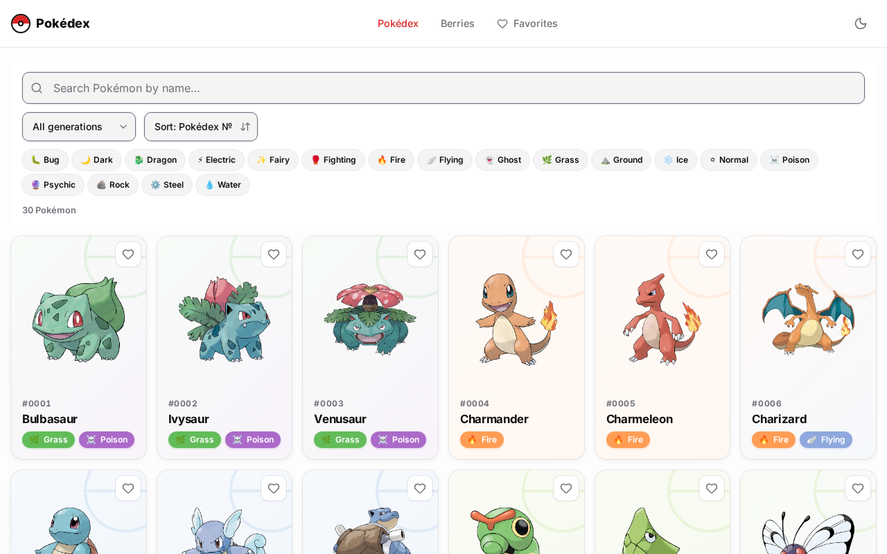 | 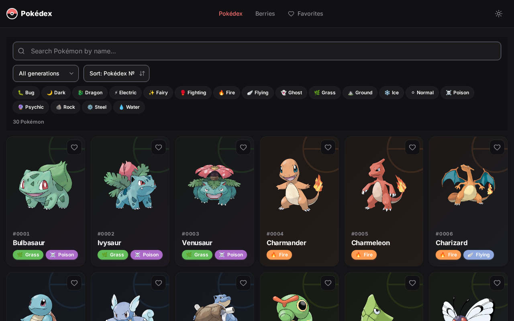 |

### Detail Page

| Light Mode | Dark Mode |
|:---:|:---:|
| 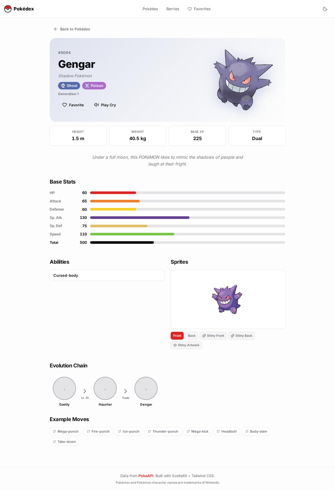 | 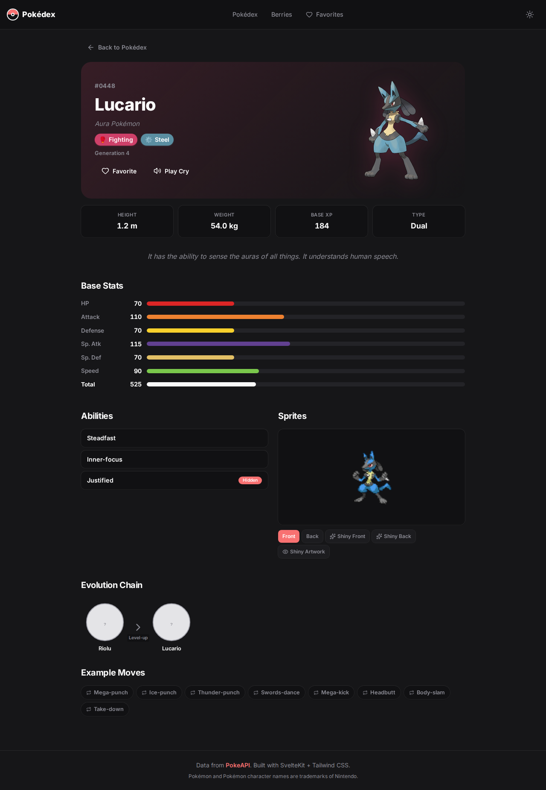 |

### Search & Filters

| Search | Type Filter | Generation Filter |
|:---:|:---:|:---:|
| 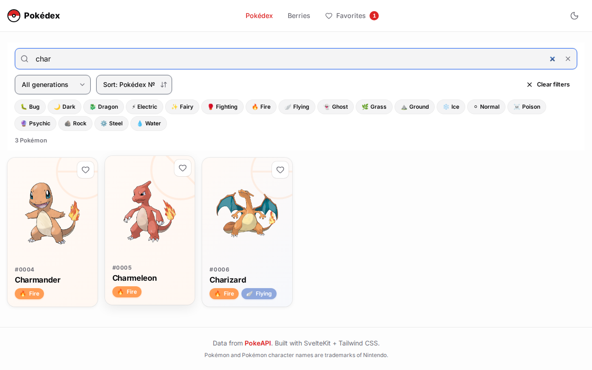 | 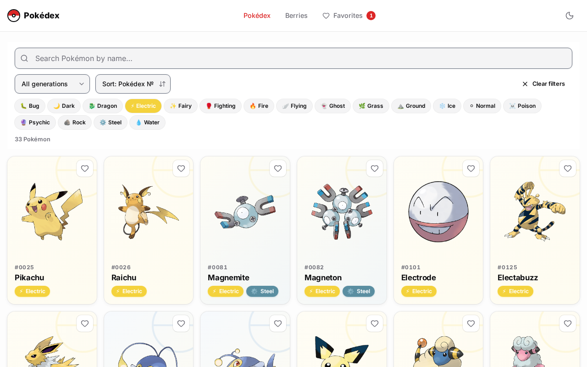 | 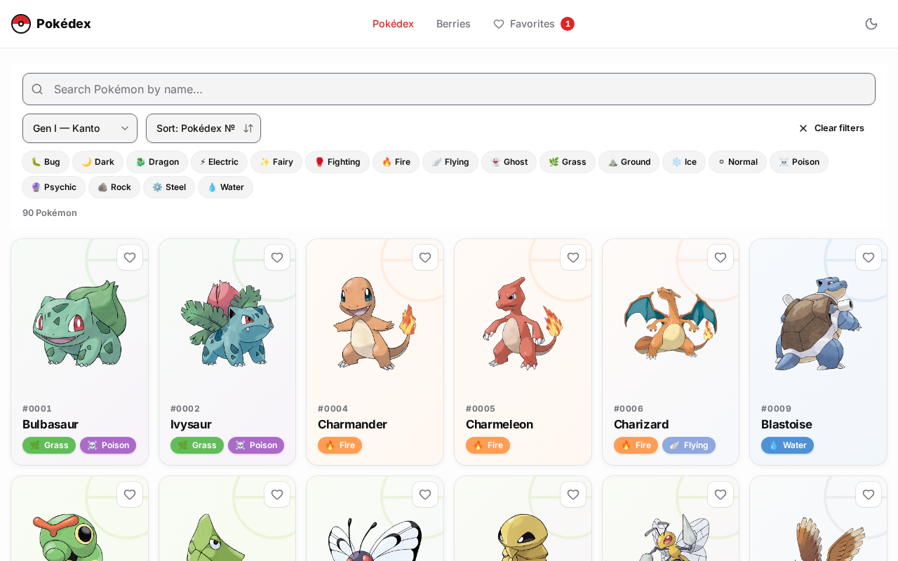 |

### More Pages

| Favorites | Berries | Berry Detail | 404 |
|:---:|:---:|:---:|:---:|
| 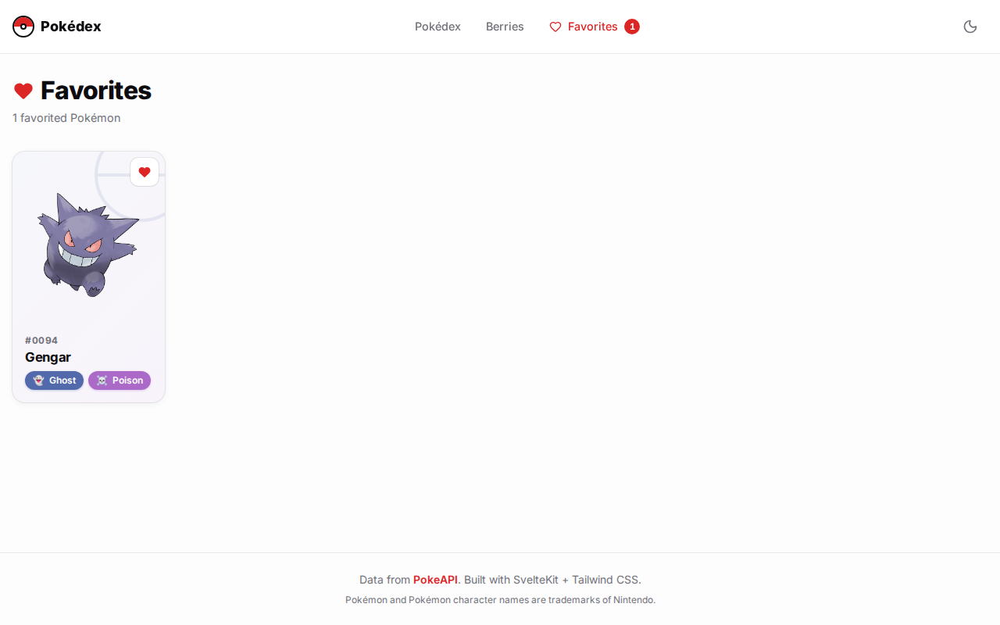 | 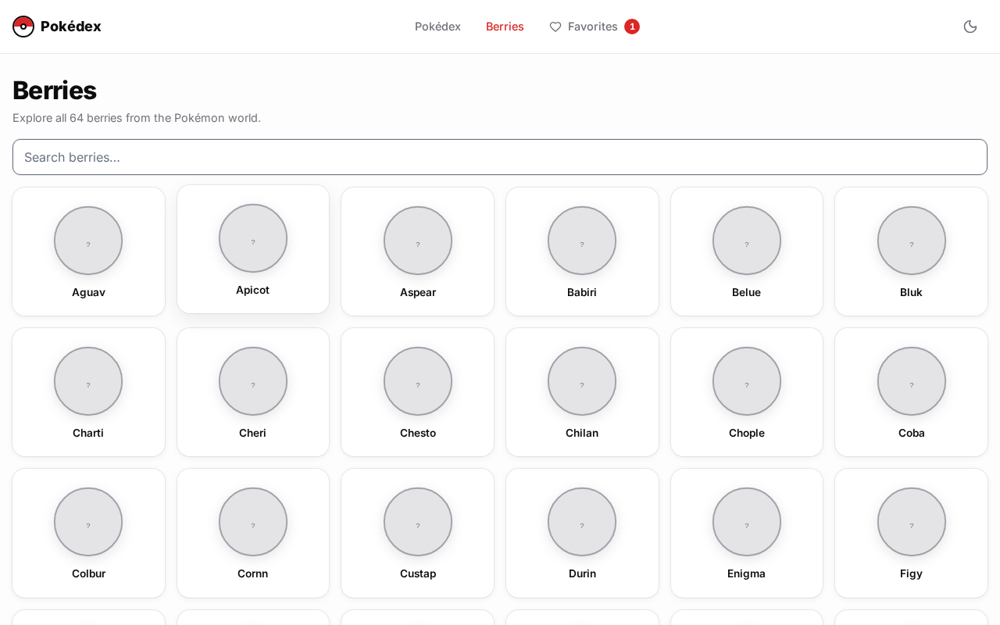 | 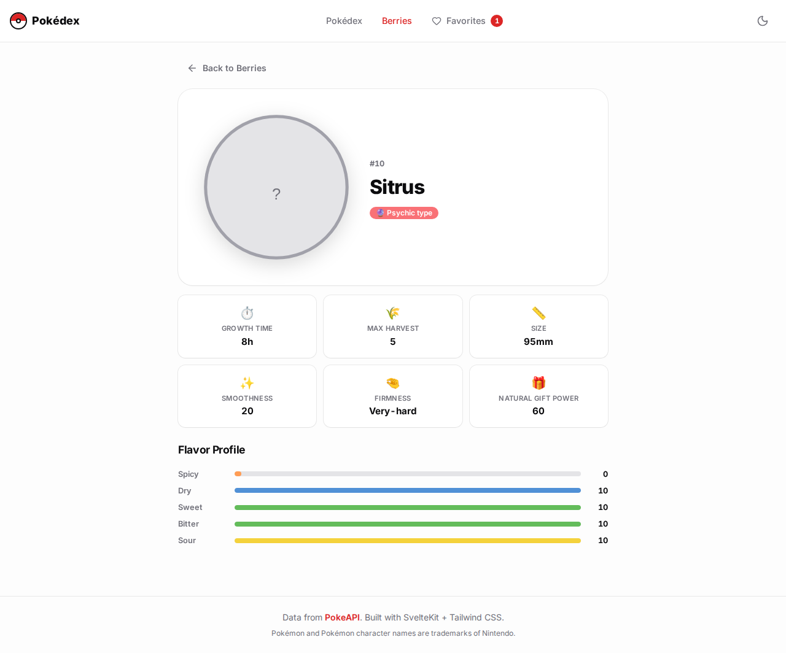 | 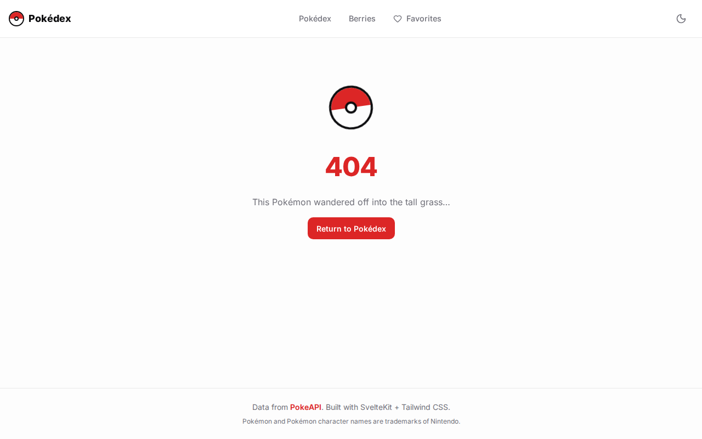 |

## 🛠️ Tech Stack

| Category | Technology |
|----------|-----------|
| **Framework** | [SvelteKit 2](https://svelte.dev/) + [Svelte 5](https://svelte.dev/) (runes) |
| **Language** | [TypeScript](https://www.typescriptlang.org/) (strict) |
| **Styling** | [Tailwind CSS v4](https://tailwindcss.com/) + hand-written CSS |
| **Icons** | [lucide-svelte](https://lucide.dev/) |
| **Validation** | [zod](https://zod.dev/) |
| **Testing** | [vitest](https://vitest.dev/) + [Playwright](https://playwright.dev/) |
| **Lint/Format** | [oxlint](https://oxc.rs/) + [oxfmt](https://oxc.rs/) (via [ultracite](https://ultracite.ai/)) |
| **Git Hooks** | [lefthook](https://lefthook.dev/) |
| **Deploy** | GitHub Pages (via GitHub Actions) |
| **Data** | [PokeAPI](https://pokeapi.co/) |

## 🚀 Run Locally

```bash
# Clone the repo
git clone https://github.com/AZagatti/pokedex-glm-52-max.git
cd pokedex-glm-52-max

# Install dependencies
npm install

# Start the dev server
npm run dev

# Open http://localhost:5173
```

### Other Commands

```bash
npm run build      # Production build (static, for GitHub Pages)
npm run preview    # Preview the production build locally
npm run check      # Type-check (svelte-check + tsc)
npm run lint       # Lint with oxlint
npm run format     # Format with oxfmt
npm run test       # Run all tests (unit + e2e)
npm run test:unit  # Run unit tests only
npm run test:e2e   # Run e2e tests only (Playwright)
```

## 🏗️ Architecture

```
src/
├── lib/
│   ├── api/
│   │   ├── pokeapi.ts      # PokeAPI client (fetch + cache + validate)
│   │   ├── cache.ts        # In-memory cache with request deduplication
│   │   ├── schemas.ts      # zod schemas (single source of truth for types)
│   │   ├── types.ts        # Pokémon type colors & gradients
│   │   └── generations.ts  # Generation ranges & labels
│   ├── components/         # PokemonCard, TypeBadge, FilterToolbar, etc.
│   └── stores/             # favorites + theme (localStorage-persisted)
├── routes/
│   ├── +page.svelte        # Home: card grid + infinite scroll
│   ├── pokemon/[name]/     # Detail page
│   ├── berries/            # Berry list + detail
│   └── favorites/          # Favorites grid
└── app.html                # HTML shell with inline theme (no FOUC)
```

**Data flow**: `load function` → `cachedFetch` (dedup + TTL cache) → `zod parse` → component.

**Theming**: CSS custom properties that flip for dark mode (no `dark:` utilities). Theme is applied inline in `app.html` before hydration.

📖 See [docs/ARCHITECTURE.md](docs/ARCHITECTURE.md) for the full technical overview and [docs/DECISIONS.md](docs/DECISIONS.md) for rationale on each technology choice.

## 📊 Performance

Built for a high Lighthouse score:
- Prerendered static routes for instant first paint
- In-memory API caching (10-min TTL) with request deduplication
- Lazy-loaded images with skeleton placeholders
- GPU-accelerated animations (`transform` + `opacity` only)
- `prefers-reduced-motion` support on every animated element

## 📄 License

MIT — Pokémon and Pokémon character names are trademarks of Nintendo. Data provided by [PokeAPI](https://pokeapi.co/).

---

<div align="center">
Built with ❤️ using SvelteKit + Tailwind CSS
</div>
